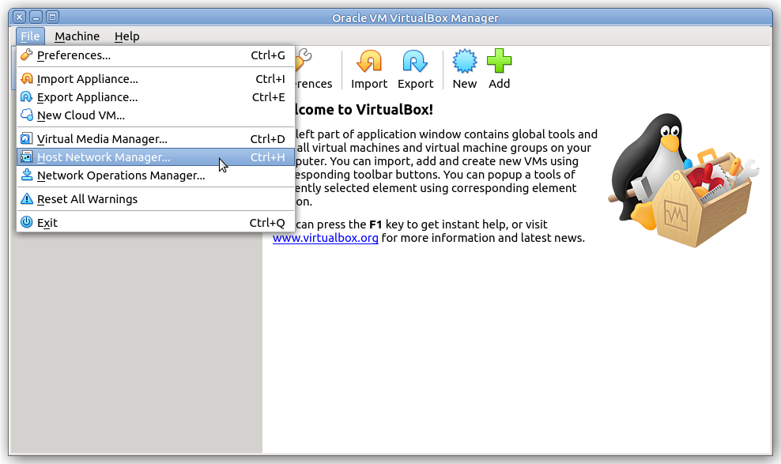
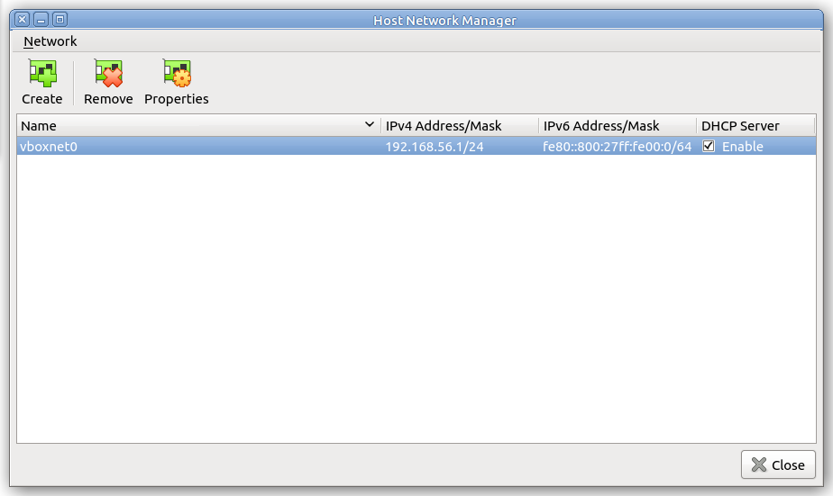
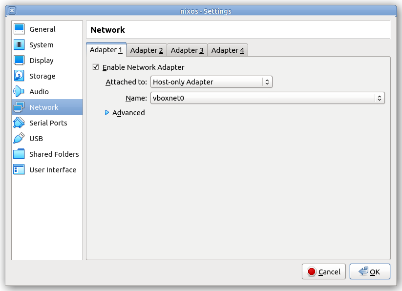

Running NixOS under VirtualBox
==============================

[VirtualBox](https://www.virtualbox.org/) is a user-friendly GUI-based hypervisor. Setting up a NixOS VM is fairly straightforward, with a minor tweak to the networking.

Setting up Networking
---------------------

Since we'll be connecting to the guest via SSH, we first need a network to connect to:

From the `File` menu choose `Host Network Manager...`

From the `Host Network Manager` window, click `Create`. It will create the network `vboxnet0`

Close the `Host Network Manager` window to bring you back to the `VirtualBox Manager` window. Now you're ready to create your new VM.

Creating the VM
---------------

From the `VirtualBox Manager` window, click "New"

Choose a name and OS type. OS type will be Linux, Other Linux (64-bit).

NixOS tends to use a fair bit of memory. Choose at least 2GB of RAM.

Choose `Create a virtual hard disk now`

The hard disk image type doesn't really matter, but VDI is the most common.

Dynamically allocated disks only take up as much physical space as the guest OS actually uses. A fixed size disk takes up the whole allocation size from the start. Fixed sized disks are slightly faster, but it really doesn't matter which you choose since we're only going to make a 16GB disk image.

Next, choose the hard disk image location. The default of `$HOME/VirtualBox VMs/nixos/nixos.vdi` is fine. Choose a disk size of 16GB.

Click `Create` to create the VM and go back to the `VirtualBox Manager` window.

Configuring Networking
----------------------

From the `VirtualBox Manager` window, click `Settings`, then `Network`.

By default, VirtualBox selects `NAT` since that's the safest option for the most common use case (connecting from the guest to other machines). But we want to be able to SSH into this VM, so we need a different network setup. You have two main choices:

* Host-only, which only allows the host to connect to the guest.
* Bridged adapter, which puts the guest on your local network (any machine on the network can connect to it).

For starters, we'll use host-only networking (you can always change this later).

Select `Host-only Adapter`. It will automatically choose the `vboxnet0` network you created earlier.

Click `OK` to go back to the `VirtualBox Manager` window.

Starting the VM
---------------

From the `VirtualBox Manager` window, click `Start`. It will ask you to choose a startup disk. Choose the NixOS minimal install ISO image.

It will boot into the NixOS boot menu. The default top entry is fine.

After awhile it will finish booting and automatically log you in as user `nixos`.

Your VirtualBox virtual machine is now booted into the NixOS minimal installer. You can now continue with the [installation](installing.md).
