Running NixOS under VirtualBox
==============================

[VirtualBox](https://www.virtualbox.org/) is a user-friendly GUI-based hypervisor. Setting up a NixOS VM is fairly straightforward, with a minor tweak to the networking.

Creating the VM
---------------

From the `VirtualBox Manager` window, click "New"

Choose a name and OS type. OS type will be Linux, Other Linux (64-bit).

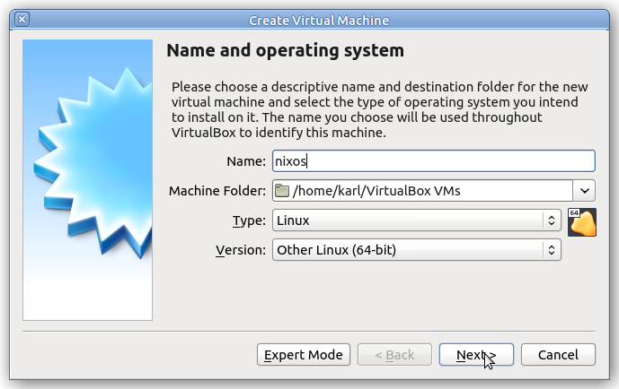

NixOS tends to use a fair bit of memory. Choose at least 2GB of RAM.

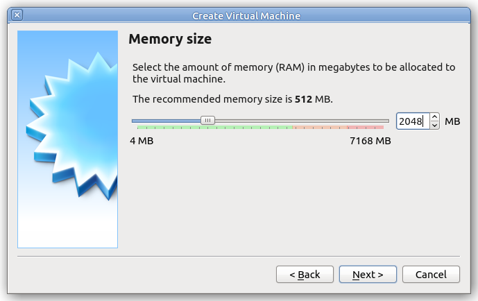

Choose `Create a virtual hard disk now`

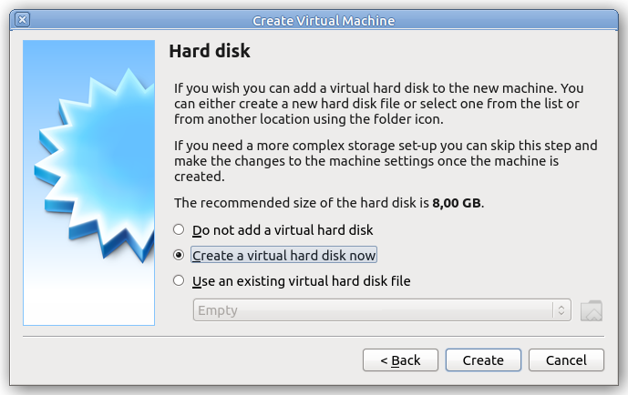

The hard disk image type doesn't really matter, but VDI is the most common.

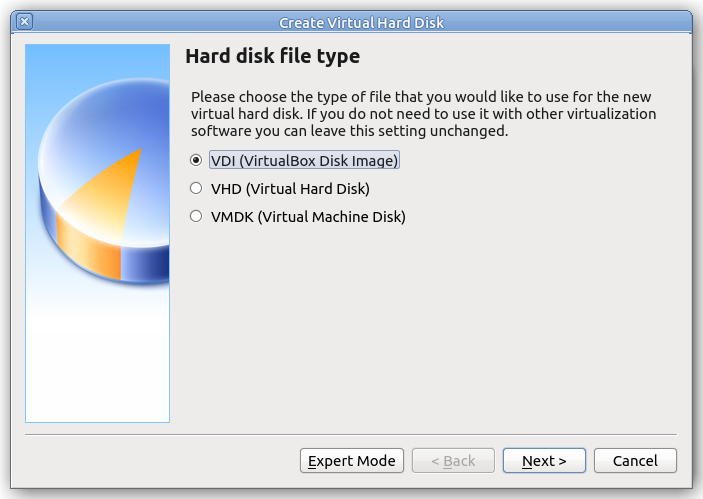

Dynamically allocated disks only take up as much physical space as the guest OS actually uses. A fixed size disk takes up the whole allocation size from the start. Fixed sized disks are slightly faster, but it really doesn't matter which you choose since we're only going to make a 16GB disk image.

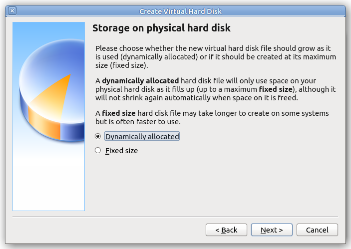

Next, choose the hard disk image location. The default of `$HOME/VirtualBox VMs/nixos/nixos.vdi` is fine. Choose a disk size of 16GB.

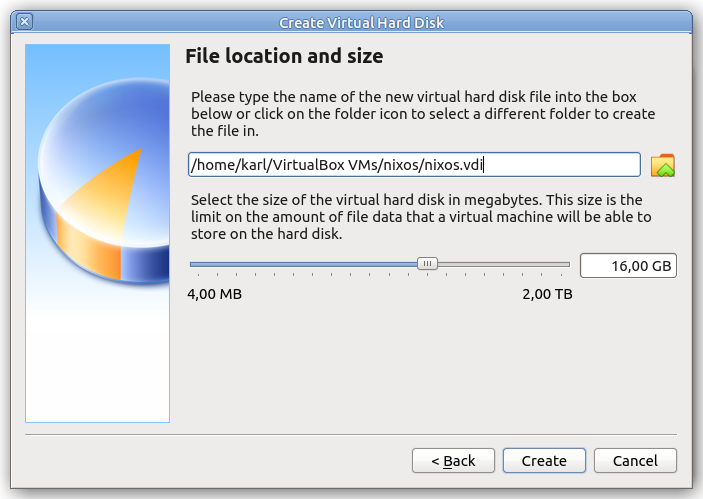

Click `Create` to create the VM and go back to the `VirtualBox Manager` window.

Configuring Networking
----------------------

From the `VirtualBox Manager` window, click `Settings`, then `Network`, then `Advanced`.

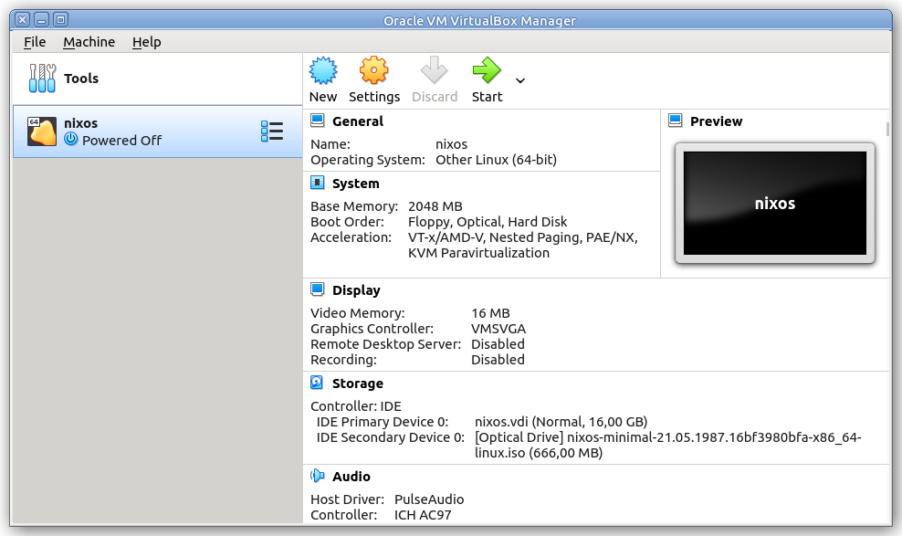
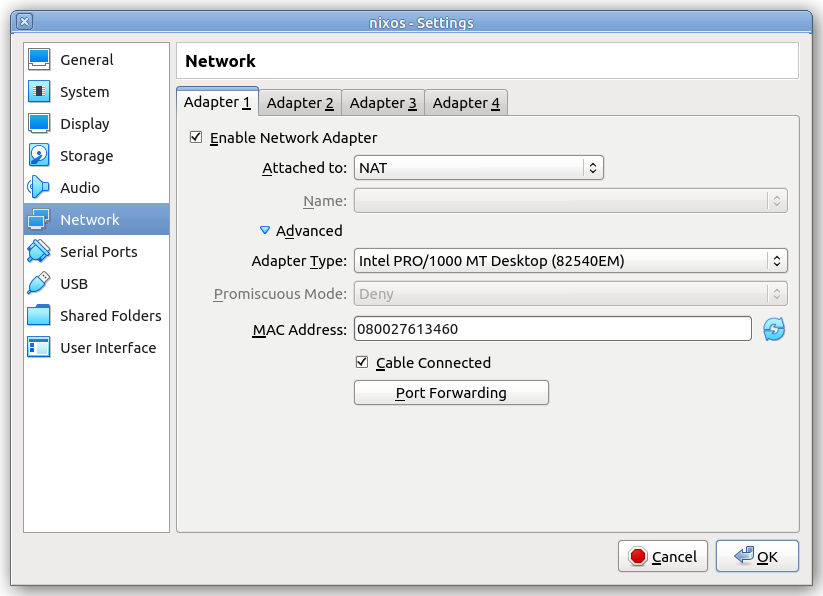

You'll need to add a port forward so that you can SSH into the machine. Click `Port Forwarding` and add a forwarding rule from port `2222` (host side) to `22` (guest side).

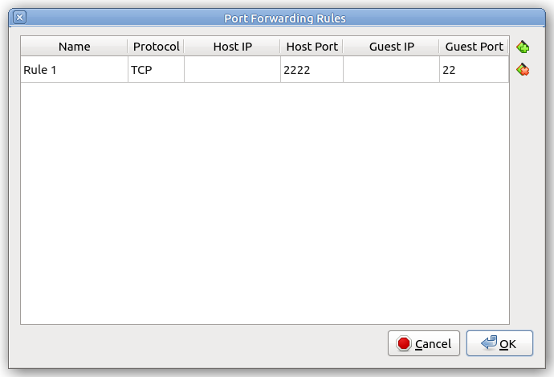

Click `OK` to go back to the network settings, then `OK` again to go back to the `VirtualBox Manager` window.

Your host machine now has port 2222 forwarded to the SSH port (22) on the guest. To SSH in to the installer for example, you would use `ssh -p 2222 nixos@localhost`.

Starting the VM
---------------

From the `VirtualBox Manager` window, click `Start`. It will ask you to choose a startup disk. Choose the NixOS minimal install ISO image.

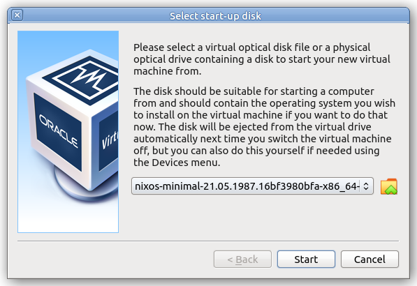

It will boot into the NixOS boot menu. The default top entry is fine.

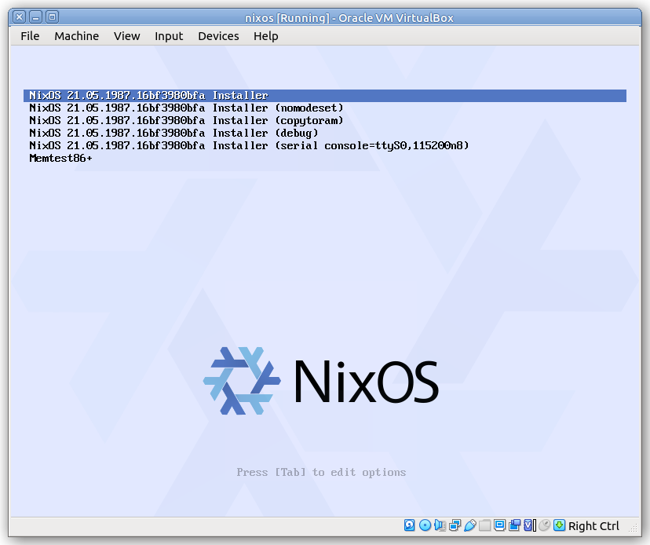

After awhile it will finish booting and automatically log you in as user `nixos`.

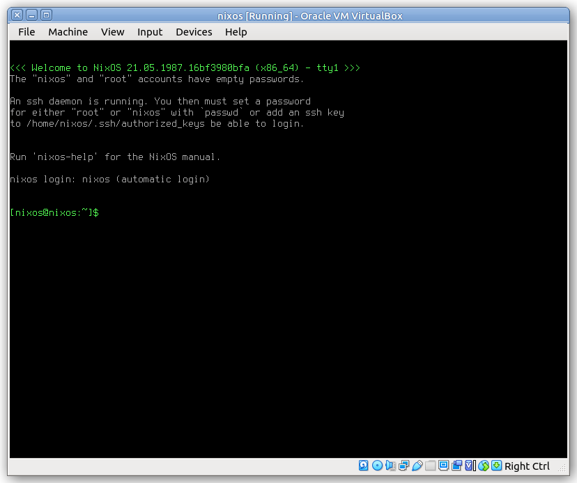

Your VirtualBox virtual machine is now booted into the NixOS minimal installer. You can now continue with the [installation](installing-vm.md#building-a-virtual-machine).
